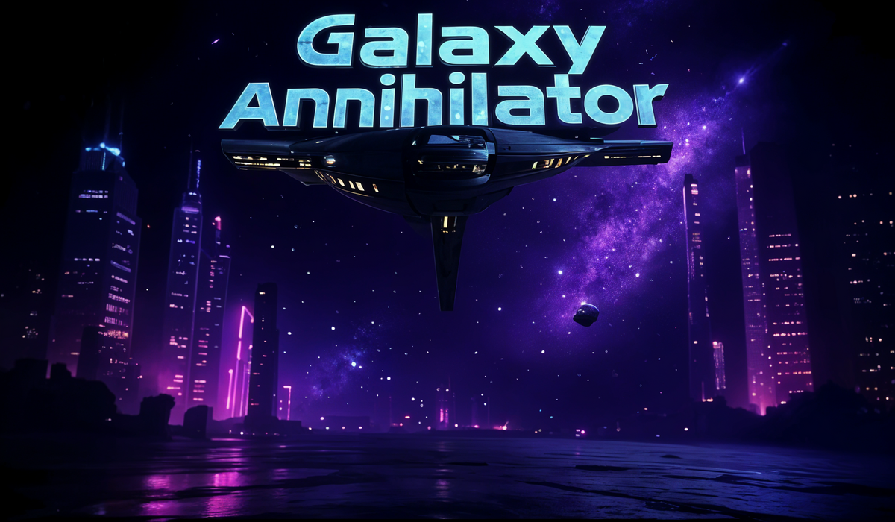

<div align="center">
<h1> Galaxy-Annihilator</h1>
</div>


---
Galaxy-Annihilator is a 2D space-shooter game made using C with the help of [iGraphics.h](https://github.com/mahirlabibdihan/Modern-iGraphics/blob/main/iGraphics.h) library. It was the project for Level-1, Term-1 of CSE-102 course.

---

<!-- Banner Image -->

<div align="center">
    
</div>

---

⚙️ Setup Guide
---
Download the ZIP file  from [here](https://drive.google.com/file/d/1Dq4rnNkAR-5CaEQe8JmtmPsrw4M_ZsCP/view) and run the Galaxy-Annihilator.exe file to play.

**For Developers**
Clone the repository or download the ZIP file from [here](https://github.com/XiNTreX/Galaxy-Annihilator/archive/refs/heads/main.zip).
```bash
git clone https://github.com/XiNTreX/Galaxy-Annihilator.git
```
Run the game using the following command in the terminal or openning the runner.bat file
```bash
.\runner.bat
```

---
🎮 Gameplay 
---

Navigate through the help menu to learn all the controls and jump into the game which can be played in three different modes!

---

**Developed by**

[Priom Hazra Raj](https://github.com/XiNTreX)

[Rupom Sinan Supto](https://github.com/Hermit0007)

**Under the Supervision of**

[Anwarul Bashir Shuaib sir](https://github.com/shuaibw)

---
